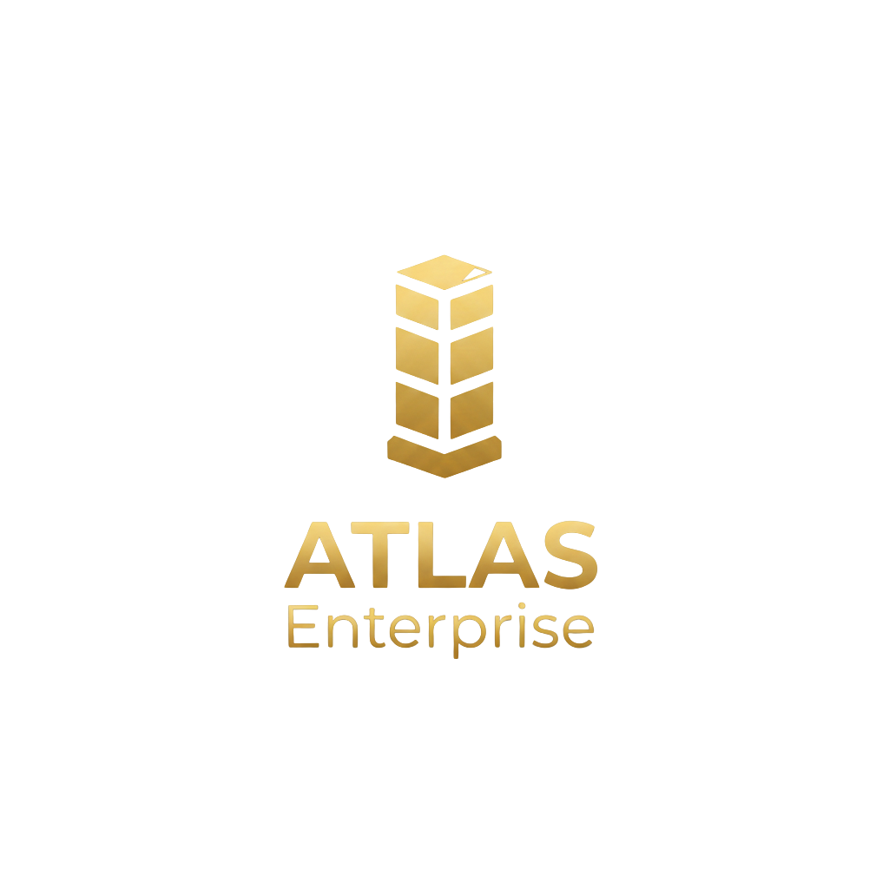

# ATLAS Lite - Demo Version

<p align="center">
  
</p>

<p align="center">
  <strong>Advanced Technical Laboratory for Analysis & Strategy</strong><br>
  Demo Version for Portfolio
</p>

<p align="center">
  
  
  
</p>

---

## 🚀 Demo Online

**[Ver Demo ao Vivo](https://seu-usuario.github.io/atlas/)**

---

## Sobre

Esta é uma versão de demonstração do **ATLAS Enterprise**, um sistema de gestão financeira pessoal e empresarial construído como Progressive Web Application (PWA).

### Tecnologias

- **100% Client-Side** — Sem servidor, executa no navegador
- **Vanilla JavaScript** — Zero dependências
- **WebAssembly** — Simulações Monte Carlo em C compilado
- **Canvas 2D** — Gráficos nativos sem bibliotecas

---

## Módulos Incluídos

| Módulo | Descrição |
|--------|-----------|
| **Dashboard** | Visão geral da saúde financeira |
| **Juros Compostos** | Simulador de investimentos |
| **FIRE** | Calculadora de independência financeira |
| **Comparador** | Análise comparativa de investimentos |
| **Simulações** | Monte Carlo e DCF (WASM) |
| **Cenários** | Simulações what-if |
| **Metas** | Objetivos estratégicos |
| **Índice Atlas** | Score de saúde financeira (0-100) |

---

## WebAssembly

O módulo de Simulações utiliza WebAssembly para cálculos de alta performance:

- **Monte Carlo FIRE** — 10.000 simulações em ~50ms
- **Monte Carlo Investment** — Análise probabilística
- **DCF Valuation** — Fluxo de caixa descontado
- **NPV/IRR** — Valor presente líquido e taxa interna de retorno

O código fonte em C está disponível em `/wasm/src/`.

---

## Executar Localmente

```bash
# Clone o repositório
git clone https://github.com/seu-usuario/atlas.git
cd atlas

# Sirva com qualquer servidor HTTP
npx serve .
# ou
python -m http.server 8000

# Acesse http://localhost:8000
```

---

## Limitações da Demo

- **Sem persistência** — Dados resetam ao recarregar
- **Dados de exemplo** — Pré-carregados para demonstração
- **Módulos limitados** — 8 de 20 módulos do sistema completo

---

## Versão Completa

A versão completa do ATLAS Enterprise inclui:

- 20+ módulos financeiros
- Multi-workspace (Pessoal, Investidor, Holding, Empresa)
- Persistência local (IndexedDB + localStorage)
- Relatórios executivos em PDF
- Stress test e análise de cenários
- E muito mais...

---

## Licença

Demo Version — © 2026 ATLAS Enterprise

---

<p align="center">
  <strong>ATLAS Lite v5.0</strong><br>
  <em>Demo for Portfolio</em>
</p>
